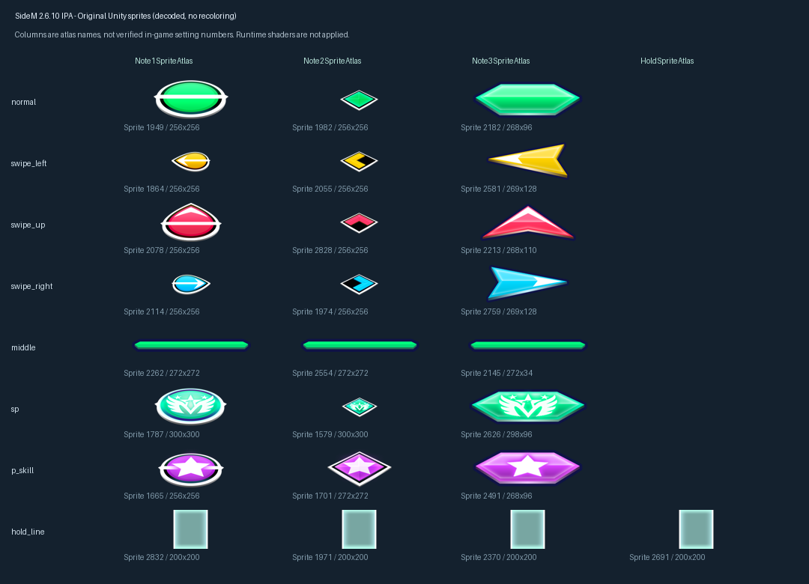

# Unity 原始音符贴图核实

输入 HEAD `8e1adbd4`。用户要求对照 Unity 资源核实具体贴图。本批只解码、核实及保存来源，不改长轨预览的呈现；现有预览仍使用示意 SVG。

## 实际读取的来源

实际读取本地 `サイスタ 2.6.10.ipa` 内的 `Payload/BNEI0395.app/Data/data.unity3d`，73,489,866 字节，Unity `2020.3.34f1`。成员 SHA-256：`fb28e28793e4f9d21e76dd96be2c776a71382cb607d98acd24f65f20bed8018a`。同时核对 `global-metadata.dat` 的 native 字段声明，SHA-256 `658f966af11aef965b541e093889056cafa61a7f7fcd4bbf38e1ca2eab6d6e00`。

`resources.assets` 中确认三套音符图集、独立长条图集及 SP 演出图集：

| 图集 | Atlas PathID | Texture PathID | 原始纹理尺寸 | 实际内容 |
| --- | ---: | ---: | --- | --- |
| Note1SpriteAtlas | 106483 | 304 | 1024×1024 | 圆形风格音符 |
| Note2SpriteAtlas | 106484 | 281 | 1024×1024 | 菱形风格音符 |
| Note3SpriteAtlas | 106485 | 319 | 512×1024 | 扁平横条、箭头风格音符 |
| HoldSpriteAtlas | 106482 | 295 | 256×256 | 独立 `live_notes_hold_line` |

这些是图集名称，不直接等同于游戏设置中皮肤编号 / 默认皮肤。保存 29 张 `live_notes_*` 原始 Sprite PNG，总共 606,447 字节；每张都有 Sprite / Atlas / Texture PathID、RenderDataKey、原始 rect、打包 rect、packing flags、pivot / border、透明区域、PNG 及像素 SHA-256。JSON 审计见 `config/song-chart-sprite-audit.v1.json`，PNG 在 `public/assets/song-chart-sprites`。

通过 Sprite 的 `m_RenderDataKey` 查找所属 Atlas 的唯一 `m_RenderDataMap` 项，再由 UnityPy 解包纹理、处理图集旋转 / 裁剪。没有直接根据文件名猜测 atlas 坐标，没有给原始图标重新着色。

## 实际图形与当前预览的差别

三套图集的普通音符均为绿色，左 Flick 黄色，上 Flick 红 / 粉红色，右 Flick 青色。`live_notes_middle` 是绿色细横条；`live_notes_sp` 是绿色徽记，`live_notes_p_skill` 是紫色星形，二者是独立资源。`LiveSpriteAtlas` 另有 `spappeal` 及其背景、flash、dummy 图形，不应把这些演出图形混作普通音符。

`live_notes_hold_line` 是带亮边的半透明渐变长条，三套音符图集及独立 Hold 图集共四个 Sprite 解码后像素完全一致：`823a5fdb83392d067b265b719be6150927d1c860eaf663ce033f53f2ab98c2d4`。

现有长轨的蓝色 Tap、统一粉色 Flick、绿色纯色长条属于示意画法，不能称为已使用原皮肤。本批明确这一差异，并提供原资源对照：

对照图为了便于观察，将透明空边裁至可见区域并缩放到格内；原始 PNG 仍保留解码后的完整 Sprite 尺寸与透明通道。它是原始资源对照，不是原游戏运行截图。

## 引用复核及仍未确认的部分

native `RhythmIconListItem` 声明顺序包括 `_toggle`、`_notesNormalImage`、`_notesSwipeUpImage`、`_notesSwipeLeftImage`、`_notesSwipeRightImage`。IPA 中三条同类组件都为 92 字节；MonoBehaviour 32 字节通用头之后的五个 12 字节 PPtr 能分别解析到 Toggle / Image。对应 Image 原始负载的 offset 88 可以找到音符 Sprite 引用，结果保留在审计中。

这是根据 native 声明顺序及原始 PPtr 字节建立的适配，不声称已取得缺失的完整自定义 TypeTree。序列化默认引用存在混用：`RhythmIconListItem_1` 和 `_3` 的 normal / up / left 引用 Note1，right 引用 Note2；`_2` 四个图标均引用 Note2。故不能把 prefab 的 `_1/_2/_3` 直接当作最终运行时图集选择，更不能由这些默认引用断言默认皮肤。

扫描序列化 Material 未找到对上述 atlas textures 的直接引用。native `NoteDrawManager` 有 materials / atlasInfos / meshes，`NoteMesh` 与 `HoldMesh` 有 matForDraw / meshForDraw 等运行时字段。贴图已恢复，但运行时动态材质、Shader、颜色叠加、Mesh 尺寸 / 透视与长条 UV 映射仍待核实；无直接 Material 引用不等于游戏没有使用这些纹理。

`EventNoteType.SPECIAL = 9` 对应 `live_notes_sp` 还是 `p_skill` 的最终绘制规则、LARGE 宽度、长按头尾分配等尚未由运行代码证明，暂不凭图名强行绑定。可确定的是原图集和解码内容已具备，后续原皮肤接入有来源基础。

## 可重复验证与边界

运行 `python scripts/audit-song-note-sprites.py --ipa <本地 IPA 路径>` 生成上述小型审计与 PNG；`--check` 重新从 IPA 解码，逐一比较完整审计及全部 29 个 PNG 字节。核实了图集唯一键、完整来源、native 字段顺序、各 Sprite 像素及输出身份。两步均通过。

本批仅新增资源审计脚本、证据 JSON、小型 PNG 和记录。没有复制 IPA、`data.unity3d`、音频或其他公共语料，没有改前端组件、只读模型和已运行的 5200 服务。依据构建政策执行内容 / 资源身份 / diff 检查，无需再次 Vite 构建；不新增 UI / Browser 或真实设备验收声明。
