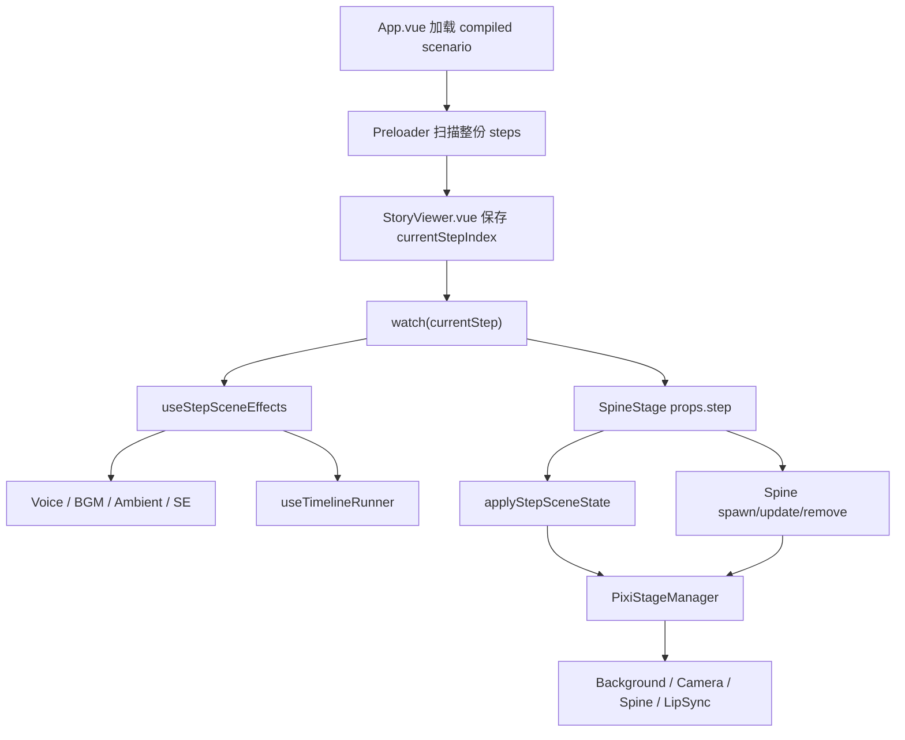
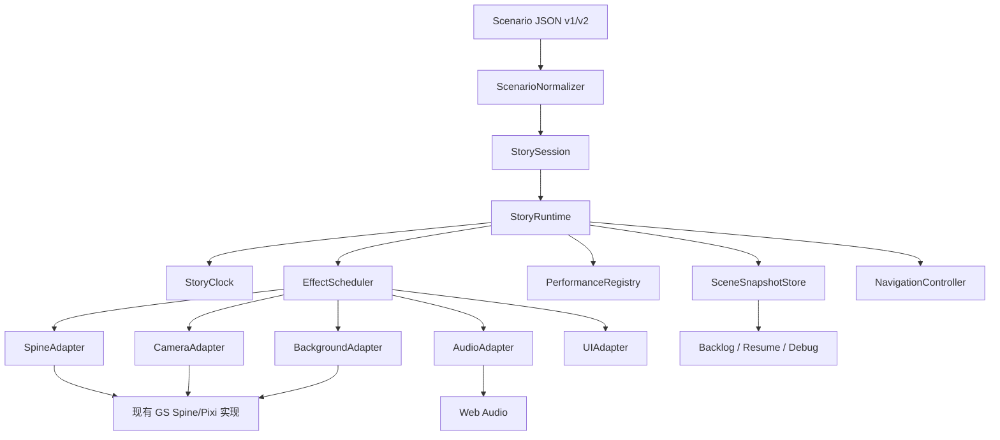
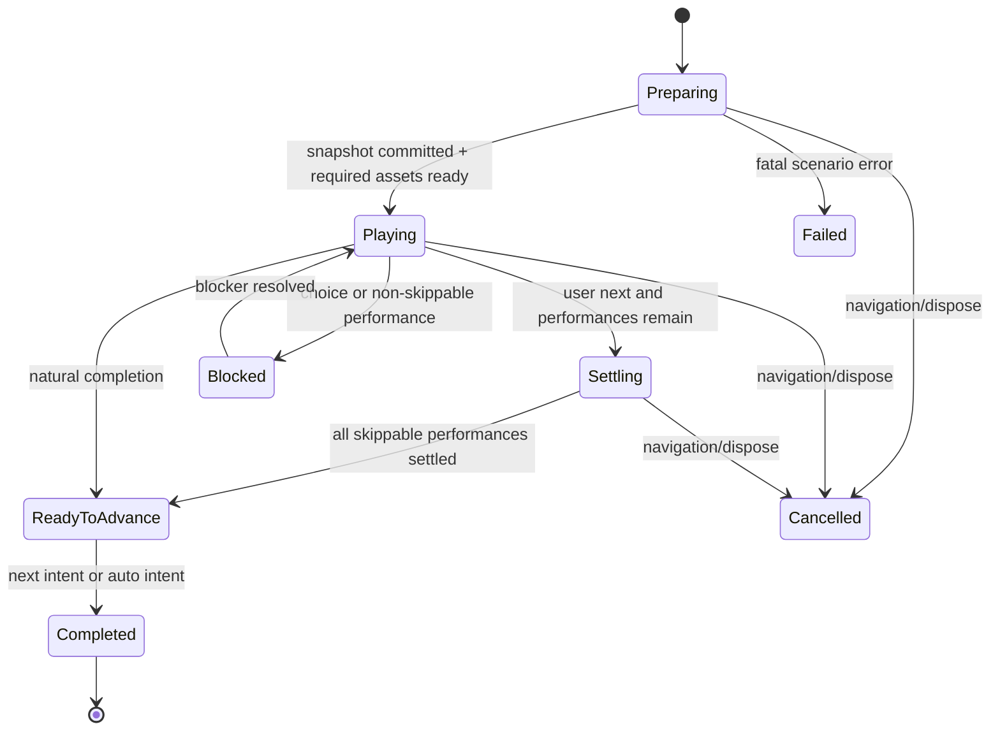

# GS_Archive 剧情预览器运行时重构技术设计

> 2026-07-22 接续审计、当前完成度与下一窗口测试入口见 [STORY_VIEWER_NEXT_WINDOW_AUDIT_20260722.md](./STORY_VIEWER_NEXT_WINDOW_AUDIT_20260722.md)。本文继续作为 Runtime 语义规范，不作为当前进度表。

> 本地化补充契约：剧情文本身份、翻译覆盖层、speaker/choice identity、Backlog 语言重算与 Preferences schema v2，统一由 [STORY_LOCALIZATION_CONTRACT_20260719.md](./STORY_LOCALIZATION_CONTRACT_20260719.md) 定义。本文中 `text_cn`、`language_mode` 和显示字符串式 Choice 仅视为迁移前示例。

> 文档状态：Runtime 语义规范；核心模块与 Spine channel 已实施，其余 channel 迁移和旧路径清理仍在进行。准确进度以 2026-07-22 接续审计为准
>
> 编写日期：2026-07-18
>
> 适用范围：`web_viewer` 剧情编译、加载、播放、回溯与播放器产品能力
>
> 不适用范围：资料门户重构、Chibi 舞台、Unity 粒子完美复刻、重新设计既有 Y 轴方案
>
> 核心决定：保留 Vue 3 + PixiJS 7 + Spine 3.8 与现有 GS 专用还原逻辑；参考 WebGAL 的运行时契约，不接入 WebGAL 引擎。

---

## 1. 文档目的

本文定义 GS_Archive 剧情预览器下一阶段的目标架构、数据契约、运行语义、迁移顺序与验收方法。它用于回答以下问题：

1. 当前播放器为什么会反复出现镜头、音效、Spine 动作和跳步时序不一致。
2. 哪些现有能力必须保留，哪些模块需要新增或收敛。
3. 编译后的剧情 JSON 应如何区分稳定状态、定时演出和档案证据。
4. 用户点击、Auto、Skip、Backlog、上一句、跳转和刷新恢复分别应执行什么语义。
5. 如何在不一次性推翻现有播放器的前提下逐步迁移。
6. 每一批改动如何验证、提交和回滚。

本文是后续实现的技术基线，不授权一次性大重构。实施时仍应遵循仓库已有原则：小步、可回滚、可 smoke test、保持旧接口兼容，不重新展开已经冻结的 Y 轴和 bounds 探索。

---

## 2. 执行摘要

### 2.1 最终技术方向

继续保留以下主链：

```text
Raw scenario + masterdata + asset evidence
                    ↓
        scenario_compiler.py
                    ↓
          Compiled Scenario IR
                    ↓
              StoryViewer
                    ↓
             GS StoryRuntime
                    ↓
     Spine / Camera / Audio / Background / UI
```

不迁移到 WebGAL，不把 WebGAL 作为 iframe 或第二播放器，也不把 GS Spine Runtime 改造成 WebGAL figure 插件。

### 2.2 重构的真正中心

重构中心不是 Vue 组件拆分，而是新增一个统一的剧情运行内核：

- `StoryClock`：唯一的剧情时间基准。
- `EffectScheduler`：调度该步所有定时 cue。
- `PerformanceRegistry`：维护正在运行的演出及其阻塞/结算状态。
- `SceneSnapshotStore`：保存稳定舞台状态和历史节点。
- `StoryRuntime`：统一接受用户意图并协调上述模块。
- `RuntimeAdapter`：把通用 cue 转交给 GS 专用 Spine、镜头、音频和背景实现。

### 2.3 最优先修复的问题

当前不同演出分别使用 `requestAnimationFrame`、多个 `setTimeout`、Web Audio 时间、Pixi tween 和 Spine track 时间。用户点击“下一步”时，只能结算其中一部分，造成：

- 延迟镜头与语音起点不一致；
- 延迟 SE 与镜头不共享同一时间基准；
- 跳步后旧 timer 仍可能触发；
- 回退能恢复累计字段，但不能可靠恢复运行中演出的终态；
- 每增加一种 raw 命令，都要在编译器、监听器和舞台中分别补特殊判断。

第一阶段应先统一演出生命周期，再开发 Auto、Skip、Backlog 等产品能力。

---

## 3. 已确认的技术边界

### 3.1 当前项目技术栈

以 2026-07-18 当前工作区为准：

| 层级 | 技术 |
|---|---|
| UI | Vue 3.4 |
| 构建 | Vite 6 |
| 2D 舞台 | PixiJS 7.4 |
| 骨骼动画 | `@pixi-spine/runtime-3.8` 4.0.6 |
| 音频 | Web Audio API |
| 编译器 | Python `scenario_compiler.py` |
| 数据 | 编译后的 JSON + masterdata 索引 + 资产 manifest |
| 验证 | Node `.mjs` verifier、Python 编译检查、Vite build、浏览器 smoke |

项目当前仍以 JavaScript 为主。本次重构不要求迁移 TypeScript。新增核心模块优先使用：

- ES modules；
- JSDoc 类型；
- JSON Schema 校验编译产物；
- 必要时再局部引入 TypeScript，而不是全仓切换。

### 3.2 WebGAL 的参考边界

WebGAL 当前主仓库是 React 17、Redux Toolkit、PixiJS 6.3 和 Vite 5 的独立引擎。其 Spine 支持仍要求安装 `pixi-spine`、修改源码并构建定制引擎。

本项目只参考以下设计思想：

- 每个演出都有停止、保持和阻塞契约；
- 用户步进前先结算当前演出；
- 状态计算、状态提交和演出启动分阶段进行；
- Auto 与 Skip 复用统一步进入口；
- Backlog 保存舞台状态，而不只保存文本；
- 资源由脚本/IR 显式声明并分层预加载。

不参考或不接入：

- WebGAL 文本脚本语法和 parser；
- React/Redux UI；
- WebGAL 通用 figure 定位；
- WebGAL Spine 自动 fit；
- 传统游戏变量/存档系统；
- iframe、fork 或第二套资源路由。

官方参考：

- [WebGAL 技术介绍](https://docs.openwebgal.com/tech/)
- [WebGAL 演出接口](https://github.com/OpenWebGAL/WebGAL/blob/main/packages/webgal/src/Core/Modules/perform/performInterface.ts)
- [WebGAL 演出控制器](https://github.com/OpenWebGAL/WebGAL/blob/main/packages/webgal/src/Core/Modules/perform/performController.ts)
- [WebGAL 步进流程](https://github.com/OpenWebGAL/WebGAL/blob/main/packages/webgal/src/Core/controller/gamePlay/nextSentence.ts)
- [WebGAL Spine 说明](https://docs.openwebgal.com/en/spine.html)

若未来直接复制或派生 WebGAL 源代码，必须单独审查 MPL-2.0 的文件级开源义务。本文只借鉴架构概念，不要求复制代码。

### 3.3 不可破坏约束

1. 日文 raw/master text 继续作为 source of truth。
2. 中文内容只能作为 overlay，不能覆盖原始字段。
3. 缺失资源必须标记 unavailable/missing，不能虚构补全。
4. 既有 Prefab、root、官方画布、服装差异和特殊 silhouette 校准继续有效。
5. 不重新推翻已经稳定的 Y 轴方案。
6. Spine 3.8、多轨动画、表情 flags、眨眼遮盖、口型曲线和原子淡入淡出必须保留。
7. `start_step`、`end_step`、episode 边界、连续播放和返回集合必须兼容现有深链接。
8. Chibi 舞台运行时不并入剧情运行时；只能共享纯数据字典或通用时钟思想。

---

## 4. 当前系统审计

### 4.1 当前数据流



### 4.2 主要模块职责

| 文件 | 当前职责 | 主要风险 |
|---|---|---|
| `src/core/StoryViewer.vue` | 播放器 UI、step index、菜单、范围、episode 完成、生命周期编排 | 需要知道多个 composable 的私有清理函数 |
| `src/core/useStoryNavigation.js` | 前后步、选择、范围、历史下标 | 历史只保存下标；点击只 fast-forward Spine timeline |
| `src/core/useStepSceneEffects.js` | SE、BGM、ambient、voice、自动 silent step、调试快照 | 内含多组独立 timer |
| `src/core/useTimelineRunner.js` | 延迟 Spine face/anim/neck/color | 仅认识部分 timeline 类型；使用独立 RAF 时钟 |
| `src/components/SpineStage.vue` | Vue/Pixi 生命周期、场景同步、角色同步、定位、debug | 仍承担大量异步角色状态编排 |
| `src/core/applyStepSceneState.js` | 背景、镜头、滤镜、幕布、screen effects | 演出生命周期由各 manager 自己维护 |
| `src/core/PixiStageManager.js` | Pixi 舞台门面及大量底层逻辑 | 约 2200 行，多种 tween 和资源生命周期交叉 |
| `src/core/AudioManager.js` | BGM、SE、ambient | 与 voice 使用不同 AudioContext；部分淡出使用 timer |
| `src/core/useVoicePlayer.js` | voice fetch/decode/play、口型曲线 | 自建 AudioContext；准备与播放存在异步竞态 |
| `src/utils/Preloader.js` | 背景和 `.skel` 预热 | 未形成完整资源 manifest；语音预载被禁用 |
| `data_pipeline/scenario_compiler.py` | raw 命令状态机、累计状态、step/timeline 输出 | 稳定状态、一次性 cue、过渡元数据混在 `state` 中 |

### 4.3 当前编译模型

编译器目前维护一个累计 `ScenarioState`：背景、BGM、环境音、Spine 列表、镜头、滤镜等命令先修改状态；遇到对话或 silent stage 边界时输出完整 `state` 快照。

现有结构已经具备两个正确方向：

1. 每个可播放 step 是自包含快照，不要求前端从头重放所有 raw 命令。
2. 延迟表情、动作、颈部动作和颜色变化已经进入 `timeline`。

但当前仍存在三类字段混用：

| 类别 | 示例 | 应有语义 |
|---|---|---|
| 稳定状态 | `bg`、`bgm`、角色 model/face/anim、camera 最终 transform | 跳转恢复时立即生效 |
| 状态过渡 | `camera_zoom.delay/duration`、`idol_color_transition`、fade | 播放时执行；完成后改变稳定状态 |
| 一次性事件 | `se_events`、screen flash、wipe | 正常播放触发，回退恢复时不重播 |

编译器现在必须在 `_emit_step()` 后手动清理一次性字段，还要把 timeline 应用回累计状态。这证明数据模型已经需要显式区分 `snapshot` 与 `cues`。

### 4.4 当前时间源

| 子系统 | 当前时间源 |
|---|---|
| Spine timeline | `performance.now()` + `requestAnimationFrame` |
| SE delay | `setTimeout` |
| silent step 自动前进 | `setTimeout` |
| 调试 snapshot | `setTimeout` |
| Voice | Web Audio source + `performance.now()` 记录起点 |
| Lip-sync | voice 起点后的 `performance.now()` 采样 |
| Camera/Screen/Character tween | manager 内部 RAF/tween |
| BGM/Ambient fade | Web Audio ramp + 清理 `setTimeout` |

这些时间源不是天然错误，但缺少统一的拥有者、暂停/倍速/结算/取消协议。

### 4.5 当前点击和回退语义

当前 `goNext()` 大致执行：

1. 清理 silent-step auto timer；
2. `fastForwardTimeline()`，立即触发未执行的 Spine timeline；
3. 确保 AudioContext；
4. 保存当前 step 下标到 `historyStack`；
5. 增加 `currentStepIndex`。

它无法统一处理：

- 尚未触发的延迟 SE；
- 尚未结束的镜头、幕布和角色 tween；
- 正在异步加载的 voice；
- 已经开始但尚未完成的淡入淡出；
- 需要阻止用户推进的 choice/video 类演出；
- 回退时应恢复的运行终态。

`historyStack` 保存的是 step 下标，不是当时真实舞台快照。只要编译快照完整，普通跳步仍可工作；但动态分支、运行中演出和 Backlog 恢复需要更完整的节点。

---

## 5. 重构目标与非目标

### 5.1 目标

1. 所有剧情时序由一个 `StoryRuntime` 统一拥有。
2. 每个演出都能声明是否可跳过、是否阻塞用户、是否阻塞 Auto、如何结算和取消。
3. 正常播放、第一次点击结算、第二次点击推进具有确定语义。
4. 回退/Backlog/刷新恢复不重播一次性 SE，却能准确恢复画面状态。
5. 编译器输出保留 raw 命令证据，能定位到源命令和解释规则。
6. Auto、Skip、速度、Log、音量和偏好设置建立在同一运行内核上。
7. 逐步减少 `StoryViewer`、`SpineStage` 和 `PixiStageManager` 间的私有状态耦合。
8. 为编译器和运行时建立可自动验证的契约。

### 5.2 非目标

1. 不重新制作 GS ADV 引擎的所有 Unity shader/粒子。
2. 不重写整个资料门户。
3. 不把所有现有 JavaScript 转成 TypeScript。
4. 不为了缩短文件而机械拆分 manager。
5. 不在第一批同时开发 Auto、Skip、Backlog、存档和新 UI。
6. 不更换 Pixi/Spine 大版本。
7. 不重新编排 raw 剧情内容或合并原本独立的小话。

---

## 6. 目标架构



### 6.1 建议目录

```text
src/core/story-runtime/
  StoryRuntime.js
  StoryClock.js
  EffectScheduler.js
  PerformanceRegistry.js
  SceneSnapshotStore.js
  NavigationController.js
  ScenarioNormalizer.js
  RuntimeErrors.js
  runtimeTypes.js              # JSDoc typedef

src/core/story-runtime/adapters/
  SpineRuntimeAdapter.js
  CameraRuntimeAdapter.js
  BackgroundRuntimeAdapter.js
  AudioRuntimeAdapter.js
  UiRuntimeAdapter.js

src/core/story-runtime/handlers/
  registerDefaultCueHandlers.js
  spineCueHandlers.js
  cameraCueHandlers.js
  audioCueHandlers.js
  screenCueHandlers.js

src/data/player/
  PlayerPreferenceRepository.js
  ReadingProgressRepository.js
  BacklogRepository.js

schemas/
  compiled-scenario-v2.schema.json
  player-preferences.schema.json
  reading-progress.schema.json
```

这只是目标布局。迁移初期允许模块先放在 `src/core/`，但边界必须与上述职责一致。

### 6.2 StoryViewer 的最终职责

`StoryViewer.vue` 最终只负责：

- 接收 scenario 和播放范围 props；
- 创建/销毁 `StorySession`；
- 把 runtime 的只读 view model 交给 Vue UI；
- 把用户意图转交 runtime；
- 发送 `back`、`ready`、`next-episode` 等宿主事件；
- 控制菜单和可访问性焦点。

它不再直接：

- 清理各类 timer；
- 调用 `fastForwardTimeline()`；
- 决定某种特效如何结算；
- 同时协调 voice、SE、camera 和 Spine；
- 读取 manager 的私有字段。

### 6.3 SpineStage 的最终职责

`SpineStage.vue` 保留：

- Pixi canvas 生命周期；
- `PixiStageManager` 创建与销毁；
- resize/viewport 同步；
- runtime adapter 注册；
- 轻量 debug overlay。

所有 step 语义由 `StoryRuntime` 决定，SpineStage 只执行明确的 snapshot 或 cue。

---

## 7. Compiled Scenario IR v2

### 7.1 顶层结构

```js
{
  schema_version: 2,
  compiler_version: "...",
  scenario_id: "1_4_001_01_a",
  source: {
    raw_path: "...",
    raw_hash: "sha256:...",
    masterdata_ids: ["..."],
    compiled_at: "2026-07-18T...Z"
  },
  capabilities: [
    "spine.multi_track",
    "voice.lipsync_curve",
    "camera.zoom",
    "screen.directional_wipe"
  ],
  resource_manifest: { ... },
  episodes: [ ... ],
  steps: [ ... ],
  diagnostics: {
    warnings: [],
    approximations: [],
    missing_resources: []
  }
}
```

`schema_version` 与 `compiler_version` 必须分开：前者表示数据契约，后者表示生成实现。相同 schema 可以由多个 compiler patch 版本生成。

### 7.2 Step 结构

```js
{
  step_id: 37,
  episode_index: 0,
  type: "adv",
  dialogue: {
    speaker: "齋藤社長",
    text_jp: "むむっ、まだまだ！…",
    text_cn: "",
    voice: "...",
    lip: { path: "...", source: "compiled" }
  },
  entry_snapshot: { ... },
  settled_snapshot: { ... },
  cues: [ ... ],
  flow: {
    advance: "user",
    blocks_skip: false,
    choice_id: null
  },
  evidence: {
    source_file: "episodes/1_4_001_01_a.json",
    command_start: 138,
    command_end: 146,
    raw_types: ["text", "camera_zoom", "se"]
  }
}
```

#### `entry_snapshot`

进入本步 t=0 时应立即恢复的稳定场景。它不包含必须重播的一次性行为。

#### `settled_snapshot`

本步所有 `stateful` cue 正常完成后的稳定状态。用途：

- 用户第一次点击要求立即结束演出时落到终态；
- Backlog/上一句恢复已经阅读过的节点；
- 自动验证 cue reducer 是否正确；
- 下一步 entry snapshot 的一致性检查。

#### 为什么需要两份快照

只有 entry snapshot 时，回退到一句包含延迟镜头或延迟表情的对话，需要决定是否重新播放整段演出。只有 settled snapshot 时，正常首次播放又无法表现该句内部变化。两份快照可以明确区分“首次播放”和“恢复历史节点”。

为控制体积，后期可以把 settled snapshot 编译为结构共享或 delta；第一阶段优先正确性，不提前优化 JSON 大小。

### 7.3 SceneSnapshot

建议结构：

```js
{
  background: {
    id: "...",
    profile: null,
    filter: null,
    dof: 0,
    color: "#FFFFFF",
    persistent_effects: []
  },
  camera: {
    zoom: 1,
    offset_x: 0,
    offset_y: 0,
    filter: null
  },
  characters: {
    "001tom": {
      model: "001tom_...",
      visible: true,
      parts_visible: true,
      transform: {
        position: 0,
        pos_x: 0,
        pos_y: 0,
        scale: 1,
        idol_zoom: 1,
        idol_zoom_y_offset: 0
      },
      render: {
        priority: 0,
        alpha: 1,
        tint: "#FFFFFF"
      },
      tracks: {
        body: { animation: "wait_loop", loop: true },
        face: { animation: "face_default" },
        neck: null
      },
      face_flags: {
        anim_flag: "",
        sweat_flag: "",
        blush_flag: ""
      }
    }
  },
  audio: {
    bgm: { cue: "...", volume: 1 },
    ambient: { cue: "...", volume: 0.4 }
  },
  ui: {
    text_box_visible: true,
    image_icon: null,
    mode: "adv"
  }
}
```

Snapshot 只保存可恢复状态，不保存：

- 正在运行的 JS timer/RAF ID；
- `AudioBufferSourceNode`；
- Pixi DisplayObject 引用；
- Spine runtime object；
- 一次性 SE 是否正在发声；
- debug DOM 状态。

### 7.4 Cue 统一结构

```js
{
  cue_id: "step-37:cmd-143:camera",
  at: 1.82,
  duration: 0.35,
  channel: "camera",
  action: "camera.zoom",
  target: "stage",
  payload: {
    zoom: 1.2,
    offset_x: 0,
    offset_y: -40,
    easing: "linear"
  },
  lifecycle: {
    persistence: "stateful",
    skippable: true,
    blocks_input: false,
    blocks_auto: true,
    restore_policy: "settled"
  },
  evidence: {
    command_index: 143,
    raw_type: "camera_zoom",
    raw_values: ["1.82", "0.35", "0", "-40", "1.2"]
  }
}
```

### 7.5 Cue channel

初始 channel 集合：

| Channel | 说明 | 默认并发策略 |
|---|---|---|
| `spine:<character>:body` | 身体动作轨 | 同角色同轨新 cue 替换旧 cue |
| `spine:<character>:face` | 表情/眼部覆盖 | 由 face handler 处理成对 flags |
| `spine:<character>:neck` | 颈部独立轨 | 与 body 并行 |
| `spine:<character>:visual` | alpha/tint/position | 同属性替换，不同属性可并行 |
| `camera` | zoom/pan/reset | 新 camera transform 结算或替换旧 transform |
| `background` | bg、blur、color、持久效果 | 按子属性协调 |
| `screen` | fade/wipe/flash/punch | 默认允许明确声明的并行 cue |
| `voice` | 当前对话语音 | 同一时间只保留一个主 voice |
| `se` | 一次性音效 | 可重叠，除非 raw 有 stop/group 语义 |
| `bgm` | 循环音乐 | 单主轨、交叉淡化 |
| `ambient` | 环境音 | 单主轨、交叉淡化 |
| `ui` | text box、icon、caption | 按元素 key 替换 |

不要只用粗粒度 `spine` channel，否则脸部、身体、颈部和淡入淡出会互相错误取消。

### 7.6 Persistence

| 值 | 行为 |
|---|---|
| `stateful` | cue 完成后改变 settled snapshot |
| `transient` | 只在首次正常播放时触发，不进入稳定快照 |
| `hold` | 开始后持续存在，直到后续明确 stop/end cue |

示例：

- `camera.zoom`：`stateful`
- `spine.face`：`stateful`
- `se.play`：`transient`
- `screen.flash`：`transient`
- `background.effect.start`：`hold`
- `background.effect.stop`：结束对应 hold，并改变稳定状态

### 7.7 Restore policy

| 值 | 恢复历史节点时 |
|---|---|
| `settled` | 直接应用 cue 终态，不重播动画 |
| `replay` | 允许重新播放；只用于明确需要的非破坏性演出 |
| `suppress` | 完全不执行，例如 SE、震屏、闪光 |
| `resume` | 从保存进度继续；首阶段不启用，仅预留给视频等长媒体 |

默认规则：历史/Backlog 恢复采用捕获的 settled snapshot，所有 transient cue suppress。

### 7.8 Raw 到 cue 的映射示例

| 现有/raw | v2 action | persistence |
|---|---|---|
| `idol_face` delay > 0 | `spine.face.set` | stateful |
| `idol_animation` | `spine.body.play` | stateful |
| `idol_nobackanimation` | `spine.body.play` + `return_policy:none` | stateful |
| `idol_neckanimation` | `spine.neck.play` | transient/hold，按 raw 语义 |
| `idol_neckanimation_stop` | `spine.neck.stop` | stateful |
| `idol_fadein/out` | `spine.visual.fade` | stateful |
| `idol_color` | `spine.visual.tint` | stateful |
| `camera_zoom/resetzoom` | `camera.transform` | stateful |
| `screen_slidein/out` | `screen.directional_wipe` | transient，背景终态另入 snapshot |
| `effect_fadein/out` | `screen.fade` | transient |
| `se` | `se.play` | transient |
| `bgm` / `bgm_stop` | `bgm.play/stop` | hold/stateful |
| `environmental` | `ambient.play/stop/volume` | hold/stateful |
| `image_icon` | snapshot UI state或 `ui.icon.set` | stateful |

### 7.9 Evidence 与还原等级

每个 compiler-derived 字段和 cue 应尽可能保留：

```js
evidence: {
  source_file,
  command_index,
  raw_type,
  raw_values,
  parser_rule,
  confidence: "exact" | "derived" | "approximate" | "missing"
}
```

含义：

- `exact`：raw/masterdata 直接给出且运行时有对应实现。
- `derived`：由可靠规则推导，例如 voice 到 lip curve 路径。
- `approximate`：缺少原 shader/粒子，仅使用近似效果。
- `missing`：资源或字段缺失，不能播放。

### 7.10 编译期不变量

编译器/verifier 必须检查：

1. `cue_id` 在 scenario 内唯一。
2. `at >= 0`、`duration >= 0`，数值均有限。
3. cue 按 `at` 稳定排序；同时间保持 raw command 顺序。
4. 每个 stateful cue 应能归约到 `settled_snapshot`。
5. 当前 step 的 `settled_snapshot` 与下一步 `entry_snapshot` 在允许差异之外一致。
6. transient cue 不泄漏进后续 snapshot。
7. fadeout 完成后角色在 settled snapshot 中不可见或不存在。
8. choice target 必须落在当前播放范围允许的 step/episode 中。
9. evidence command index 必须落在源命令数组范围内。
10. 缺失资源进入 diagnostics，不静默替换成虚构资源。

---

## 8. StoryClock

### 8.1 目标

`StoryClock` 是每个 step/session 的唯一逻辑时间源。它不直接执行演出，只回答“剧情时间现在是多少”并通知 scheduler。

### 8.2 推荐接口

```js
class StoryClock {
  start({ offset = 0, rate = 1 } = {})
  pause()
  resume()
  stop()
  seek(seconds)
  setRate(rate)
  now()               // logical seconds
  toAudioTime(seconds, audioContext)
  subscribe(listener)
  dispose()
}
```

### 8.3 时间计算

```text
logicalNow = offset + (monotonicNow - startedAt) × rate
```

- `monotonicNow` 使用 `performance.now()`。
- pause 时冻结 logicalNow。
- resume 时重设 startedAt，不让暂停时长进入剧情时间。
- rate 改变时先固化当前 offset，再从新 rate 继续。
- 所有 cue 判断使用 logical time，不直接读取 wall clock。

### 8.4 与 Web Audio 的关系

Web Audio 对精确音频调度更可靠，因此 AudioAdapter 应把逻辑 cue 时间映射到 `AudioContext.currentTime`：

```js
audioWhen = audioContext.currentTime + Math.max(0, cue.at - storyClock.now())
source.start(audioWhen)
```

若 cue 已迟到：

- SE：立即播放或按策略 suppress；
- voice：若是当前 step 首次播放则立即播放；
- BGM/ambient：立即进入正确状态；
- 历史恢复：不重播 transient 音频。

### 8.5 语音是否作为主时钟

默认不让 voice 成为整个 step 的唯一时钟，因为：

- 有无语音的 step 都必须工作；
- voice 可能加载失败或被 `noVoice` 禁用；
- 部分演出在语音前或语音后发生；
- 用户可能单独调整 voice 音量，而不改变演出速度。

VoiceHandle 应向 runtime 报告 `started/ended/duration/currentTime`，Auto 可以等待 voice 结束；口型继续按 voice 实际播放位置采样，而不是按 StoryClock 猜测。

### 8.6 播放速度

需区分两个设置：

1. `textSpeed`：文字逐字显示速度。
2. `performanceRate`：视觉演出/自动等待倍率。

首版建议：

- 只实现 `textSpeed` 和 `autoDelay`；
- 不改变 voice 音调和播放速率；
- `performanceRate` 保留为实验设置，确认 Spine、Pixi tween 和音频策略后再开放。

---

## 9. Performance 与 EffectScheduler

### 9.1 PerformanceHandle

每个 cue handler 返回一个统一句柄：

```js
{
  id: "...",
  channel: "camera",
  status: "scheduled" | "running" | "settled" | "cancelled" | "failed",
  skippable: true,
  blocksInput: false,
  blocksAuto: true,
  settle(reason),
  cancel(reason),
  pause(),
  resume(),
  finished: Promise,
  snapshotFinalState()
}
```

#### `settle()`

立即把演出推进到规定终态。例如：

- camera zoom 直接到目标 transform；
- fadeout 直接 alpha=0 并按规则隐藏角色；
- delayed face 立即切到目标表情；
- 尚未发生的 transient SE 不应因为 settle 而补播。

#### `cancel()`

停止演出但不保证应用终态，用于：

- session dispose；
- 跳转到另一个 episode；
- 异步资源完成时发现 generation 已过期；
- 新 cue 明确覆盖旧 cue，且覆盖规则不要求旧 cue 先结算。

不得用同一个“清 timer”行为同时代替 settle 和 cancel。

### 9.2 Scheduler 接口

```js
class EffectScheduler {
  loadStep(step, context)
  start()
  pause()
  resume()
  settleSkippable(reason)
  cancelAll(reason)
  hasUnsettledPerformances()
  hasBlockingInput()
  hasBlockingAuto()
  getActivePerformances()
  dispose()
}
```

### 9.3 调度规则

1. Step entry snapshot 先提交到舞台。
2. 资源准备完成后创建 cue handles，但不提前修改舞台。
3. Clock start 后按 `at` 启动 cue。
4. 同 channel 冲突由 handler 的 replacement policy 处理。
5. cue 完成后从 active registry 移到 completion record。
6. 所有 blockingAuto handle 完成后，Auto 才能开始额外等待。
7. 用户第一次 next 时优先 settle 可结算演出。
8. 有 `blocksInput=true` 的演出时，用户 next 不推进。
9. 选择步骤永远阻塞 Auto/Skip，直到用户选择。

### 9.4 Step 运行状态机



### 9.5 用户点击语义

统一 `runtime.next(intent)`：

```js
function next(intent = { source: "pointer" }) {
  if (runtime.hasBlockingInput()) return { result: "blocked" }
  if (runtime.hasUnsettledSkippablePerformances()) {
    runtime.settleCurrentStep("user-next")
    return { result: "settled" }
  }
  runtime.advance()
  return { result: "advanced" }
}
```

因此：

- 第一次点击：补完文字/镜头/淡入淡出等可跳过演出。
- 第二次点击：进入下一 step。
- 没有未完成演出时：第一次点击直接推进。
- choice：点击背景不推进。
- `blocksInput` 演出：显示明确反馈或保持无动作，不偷偷丢弃点击。

### 9.6 异步竞态控制

每次进入 step 生成一个 `generation` 或 `AbortController`：

```js
const token = session.beginStep(step.step_id)
const resource = await adapter.prepare(cue, { signal: token.signal })
if (!token.isCurrent()) return
```

所有 voice fetch、Spine load、texture load、lip curve load 都必须遵循该 token。这样可以避免用户快速前进后，旧异步任务在新 step 上错误落地。

---

## 10. SceneSnapshotStore 与恢复语义

### 10.1 三种状态

需要明确区分：

1. `compiled entry snapshot`：编译器推导的首次进入状态。
2. `compiled settled snapshot`：编译器推导的理论终态。
3. `captured runtime snapshot`：实际播放完成后从 adapter 捕获的可恢复状态。

理论上 2 与 3 应一致。开发期可以比较两者并报告 drift；生产恢复优先使用经过验证的 captured snapshot，若不存在再使用 compiled settled snapshot。

### 10.2 HistoryNode

```js
{
  node_id: "session:step-37:visit-1",
  scenario_id: "...",
  episode_index: 0,
  step_index: 36,
  step_id: 37,
  dialogue: { ... },
  selected_choices: { ... },
  snapshot: { ... },
  read: true,
  voice: { cue: "..." },
  created_at: 0,
  source_range: { start_step: 2, end_step: 42 }
}
```

不要把 Pixi/Spine 实例写入 HistoryNode。

### 10.3 上一步

`goPrev()` 推荐流程：

1. 取消当前 step 全部 performance，使用 `cancel` 而非 settle。
2. 停止当前 voice 和 transient audio。
3. 从 history 取上一个可见阅读节点，跳过纯 transition 节点。
4. 原子应用该节点 snapshot，不播放转场。
5. 恢复对话/选择显示。
6. 默认不自动重播 voice；由设置决定是否“回退自动重播语音”。
7. 不重播 SE、flash、screen shake。

### 10.4 Backlog

Backlog 与 history 共用节点数据，但 UI 只展示可读条目：

- speaker；
- 日文/中文文本；
- voice replay；
- step/episode；
- 跳回按钮；
- 选择结果。

点击 voice replay 只播放该条 voice，不驱动当前舞台口型，除非未来明确实现 backlog preview stage。

点击“回到该处”时：

- 截断该节点之后的当前会话 history；
- 恢复 snapshot；
- 重设 current step；
- 保留档案已读记录，但分支会话从该点重新开始。

### 10.5 刷新恢复

本地 progress 只保存：

```js
{
  schema_version: 1,
  scenario_id,
  route,
  step_id,
  episode_index,
  updated_at
}
```

首版刷新恢复使用 compiled settled snapshot，不必持久化完整运行时 snapshot。URL 显式的 `start_step/end_step/scenario` 始终优先于 localStorage。

---

## 11. Runtime Adapter 设计

### 11.1 通用接口

```js
class RuntimeAdapter {
  prepareSnapshot(snapshot, context)
  applySnapshot(snapshot, context)
  prepareCue(cue, context)
  runCue(cue, context)
  captureSnapshot(context)
  cancelAll(reason)
  dispose()
}
```

`StoryRuntime` 不应直接访问 `manager.spineInstances` 或 Pixi container。

### 11.2 SpineRuntimeAdapter

职责：

- model/atlas/texture 资源准备；
- 角色 spawn/update/remove；
- Prefab 与现有坐标解析；
- render priority；
- body/face/neck track；
- face flags、blink cover、sweat、blush；
- parts visible；
- tint/alpha/position/fade；
- voice talking/lip curve bridge；
- runtime snapshot 捕获。

必须保留现有 GS 专用规则，不能改成 bounds 自动 fit。

建议逐步把 `SpineStage.vue` 和 `PixiStageManager.js` 中对角色的操作收进以下内部服务：

```text
SpineAssetLoader
SpineCharacterRegistry
SpinePlacementResolver
SpineTrackController
SpineFaceController
SpineLipSyncController
SpineTransitionController
SpineSnapshotCodec
```

#### Spine snapshot 最小字段

- character/spawn ID；
- model ID；
- visible/parts visible；
- Prefab-resolved transform 输入，而非只保存最终屏幕像素；
- alpha/tint/z-order；
- body animation、loop/no-back/return policy；
- face animation 与 flags；
- neck overlay 的稳定状态；
- costume/model-specific metadata version。

不应保存眨眼当前毫秒相位或嘴型瞬时开合值；恢复后从稳定 face 和 idle blink 状态重新启动。

### 11.3 CameraRuntimeAdapter

职责：

- camera zoom/pan/reset；
- camera filter；
- background 和 character 层同步 transform；
- tween settle/cancel；
- 当前 transform 捕获。

所有 camera 方法必须返回 PerformanceHandle，不能只 fire-and-forget。

```js
runTransform(target, { duration, easing }) => {
  settle: () => setTransform(target),
  cancel: () => stopAtCurrentTransform(),
  finished
}
```

### 11.4 BackgroundRuntimeAdapter

职责：

- 背景资源切换；
- bg profile/view mode；
- blur/color overlay；
- 持久背景效果 start/end；
- fallback background；
- scene snapshot 捕获。

背景切换和 screen wipe 是两个不同概念：

- 背景状态属于 snapshot。
- wipe 属于 transient cue。

例如“黑屏从左向右盖住旧背景，再从左向右揭示新背景”，应编译为明确的 cover/reveal cue 序列，而不是两个方向相反的通用 slide 猜测。

### 11.5 AudioRuntimeAdapter

建议最终统一到一个 AudioContext 和 AudioMixer：

```text
master
  ├─ bgmGain
  ├─ ambientGain
  ├─ voiceGain
  └─ seGain
```

接口：

```js
playVoice(cue, options) => VoiceHandle
playSE(cue, options) => PerformanceHandle
playBgm(cue, options) => HoldHandle
stopBgm(options) => PerformanceHandle
playAmbient(cue, options) => HoldHandle
setBusVolume(bus, value)
unlockFromUserGesture()
```

#### VoiceHandle

```js
{
  started,
  ended,
  duration,
  currentTime(),
  stop(),
  replay(),
  getLipValue()
}
```

#### 音频时序规则

1. 所有 AudioContext 解锁只在用户手势链同步触发。
2. SE 使用 AudioContext 计划时间，避免 JS timer 解码延迟。
3. 音频先 decode/cache，再按 authored timestamp start。
4. voice 加载失败不能阻塞剧情永久等待。
5. Auto 等待 voice `ended`，同时设失败/最大等待兜底。
6. 历史恢复不重播 SE；voice 是否自动重播由偏好决定。
7. BGM/ambient 是稳定状态，恢复时直接进入正确 cue/volume，可使用短 crossfade 避免爆音。

### 11.6 UiRuntimeAdapter

职责：

- 对话框模式；
- text box visible；
- title/synopsis/time caption；
- scene icon；
- choice blocker；
- text reveal performance。

文字逐字显示本身也应返回 PerformanceHandle。第一次点击先补全文字，第二次才结算其他演出/推进，具体优先级可配置，但必须全局一致。

---

## 12. 导航、Auto、Skip 与输入

### 12.1 InputIntent

所有输入统一为意图：

```js
{
  type: "next" | "previous" | "choose" | "openBacklog" | "toggleAuto" | "toggleSkip",
  source: "pointer" | "keyboard" | "touch" | "auto" | "skip" | "debug",
  timestamp: performance.now(),
  payload: {}
}
```

Vue UI、键盘和触控不应分别实现推进逻辑。

### 12.2 Auto

Auto 不是按固定 timer 直接增加 step index。

推荐流程：

1. 等待 text reveal 完成。
2. 等待所有 `blocksAuto` performance 完成。
3. 若有 voice，等待 voice ended。
4. 再等待用户设置的 `autoDelay`。
5. 发送 `{ type:"next", source:"auto" }`。
6. choice、菜单打开、页面失焦或错误状态时暂停 Auto。

### 12.3 Skip

模式：

- `readOnly`：只快进已读 step；遇到未读立即停止。
- `all`：允许快进所有普通 step。

规则：

- choice 必停；
- unavailable/fatal step 必停；
- non-skippable performance 必停；
- 每次仍调用统一 next/settle，不直接改 index；
- 不播放 transient SE/flash；
- stateful cue 直接 settle 到终态；
- BGM/ambient 保持最终正确状态；
- 可设置是否静音 voice。

### 12.4 已读状态

已读 key 不能只用数组下标，建议：

```text
scenario_id + source_hash + step_id
```

当 compiled scenario 因 compiler 修复但 raw 未变化时，可设计迁移；当 raw hash 改变导致 step 语义变化时，保守地重新标记相关节点未读。

### 12.5 键盘与触控

建议：

| 操作 | 默认行为 |
|---|---|
| 左键/Enter/Space/右方向 | next intent |
| 左方向/鼠标滚轮上 | previous 或打开 backlog，按产品决定 |
| Esc | 关闭菜单/Backlog，最后才返回 |
| A | Auto |
| S/Ctrl | Skip |
| H | UI hide |
| L | Log/Backlog |
| 长按 | 临时快进，可后置 |

所有快捷键在 input/select 或菜单交互控件聚焦时应禁用。

---

## 13. Player Preferences 与本地状态

### 13.1 PlayerPreferences

```js
{
  schema_version: 1,
  language_mode: "JP" | "CN" | "BILINGUAL",
  auto_enabled: false,
  auto_delay_ms: 800,
  skip_mode: "readOnly",
  voice_on_back: false,
  ui_hidden: false,
  volumes: {
    master: 0.7,
    bgm: 0.5,
    ambient: 0.4,
    voice: 1,
    se: 0.6
  }
}
```

> 2026-07-23：`text_speed` 从实际 Preferences 契约中退役。播放器没有逐字打印运行时，保留该字段会错误暗示存在可调文本速度；repository 读取旧 v2 payload 时会保留其他偏好并移除该键。

存储规则：

1. 使用版本化 repository，不在组件内散落 localStorage key。
2. 读取失败回到默认值，不阻止播放。
3. 提供迁移和清空入口。
4. URL 的显式调试/范围参数优先于本地偏好。
5. 静态 masterdata 与 compiled JSON 永远不写入用户状态。

### 13.2 会话状态与长期状态分离

| 会话状态 | 长期状态 |
|---|---|
| current step、active cues、history、menu open | progress、read set、favorite、preferences |
| 内存中 | versioned local repository |
| 页面关闭即可丢弃 | 刷新后恢复 |

---

## 14. 资源清单与预加载

### 14.1 ResourceManifest

编译期生成：

```js
{
  immediate: [
    { type: "background", id: "...", urls: ["..."], required: true },
    { type: "spine", id: "...", urls: [".skel", ".atlas", ".png"], required: true },
    { type: "voice", id: "...", urls: ["..."], required: false }
  ],
  episode: [ ... ],
  next_episode: [ ... ],
  optional: [ ... ],
  missing: [ ... ]
}
```

### 14.2 分层策略

1. `immediate`：首屏背景、当前角色完整 Spine、当前/下一句语音。
2. `episode`：当前小话剩余背景、Spine、语音、SE。
3. `next_episode`：连续播放开启后后台预取。
4. `optional`：近似效果或可关闭特效。
5. `missing`：直接呈现 unavailable/fallback，不循环重试。

### 14.3 Spine 预载

不能只 fetch `.skel` 并假定 atlas/texture 必然瞬时可用。manifest 应列出实际 atlas page 和纹理候选；预加载器应复用现有 atlas fallback 规则，但不复制一套不同的路径猜测。

### 14.4 Voice 预载

当前因下载管理器/扩展嗅探问题禁用了全量语音预载。新策略应：

- 只预取当前和相邻少量 voice；
- 校验 HTTP status、content-type 和最小字节数；
- 使用 AbortController 和并发限制；
- 失败后由按需播放路径继续尝试候选 URL；
- 不把 HTML fallback 缓存成音频成功结果。

### 14.5 Cache key

资源缓存 key 至少包含：

```text
asset type + canonical id + resolved URL + manifest/version
```

开发环境 cache-busting 与生产缓存策略应分开，不能长期对所有 voice 添加 `Date.now()` 导致无法利用浏览器缓存。

---

## 15. 错误、降级与可观测性

### 15.1 错误分级

| 等级 | 示例 | 行为 |
|---|---|---|
| `fatal` | scenario schema 无法解析、step target 越界 | 停止当前剧情并显示可诊断错误 |
| `recoverable` | voice/SE 缺失、单个 Spine 资源缺失 | fallback/suppress，剧情继续 |
| `approximation` | 原粒子不可用，使用 Pixi 简化效果 | 播放并记录 approximate |
| `diagnostic` | settled snapshot 与 runtime capture drift | 开发环境警告，生产可采样记录 |

### 15.2 RuntimeEvent

```js
{
  type: "cue.started" | "cue.settled" | "cue.failed" | "step.entered" | "step.completed",
  session_id,
  scenario_id,
  step_id,
  cue_id,
  logical_time,
  wall_time,
  details
}
```

### 15.3 调试面板

开发模式建议显示：

- session/step/generation；
- StoryClock 时间和 rate；
- active performance；
- blockingInput/blockingAuto 原因；
- 最近触发 cue；
- raw command index；
- snapshot drift；
- missing/approximate 资源。

不要重新把大量旧 bounds/pivot 实验字段塞回主 debug 面板。定位信息按需展开。

### 15.4 全局调试 API

正式整理后可保留：

```js
window.storyRuntime.inspect()
window.storyRuntime.dumpSnapshot()
window.storyRuntime.listActivePerformances()
window.storyRuntime.settleCurrentStep()
```

生产构建应关闭或只保留只读接口。

---

## 16. 测试与验证策略

### 16.1 测试金字塔

```text
少量浏览器视觉/音画验收
        ↑
Adapter 集成测试
        ↑
Runtime + fake clock 契约测试
        ↑
Compiler/schema/reducer 纯数据测试
```

### 16.2 编译器测试

至少覆盖：

- raw command 到 cue 映射；
- entry/settled snapshot；
- transient 不泄漏；
- 同时刻 cue 顺序；
- 80ms merge 是否仍有必要，以及是否会破坏 raw 精度；
- fadeout 的 entry visible/settled hidden；
- camera delay/duration；
- 多个 SE 同步与延迟；
- choice target；
- episode 边界 carry/reset；
- evidence command index。

建议把 compiler golden fixture 放到独立小样本目录，不从 raw 全目录随机抽取。

### 16.3 Fake clock 测试

Runtime 测试不使用真实等待：

```js
clock.start()
clock.advanceBy(1.81)
expect(cameraZoom).not.toHaveStarted()
clock.advanceBy(0.01)
expect(cameraZoom).toHaveStarted()
```

必须验证：

- pause/resume；
- rate 修改；
- 同时间 cue 稳定顺序；
- 第一次 next settle；
- 第二次 next advance；
- cancel 后旧 cue 永不触发；
- 异步 prepare 完成但 generation 过期时不落地；
- Auto 等待 blockers 和 voice；
- Skip 遇 choice 停止。

当前仓库没有通用单测框架。实施时可选择：

- 继续使用 Node `.mjs` verifier 与注入 fake clock；或
- 单独引入 Vitest，用于纯 JS runtime 单测。

不应为了测试而要求浏览器实际等待数秒。

### 16.4 Adapter 合约测试

每个 adapter 使用同一套断言：

1. `runCue()` 返回有效 handle。
2. `settle()` 后舞台为目标终态。
3. `cancel()` 后不再继续修改舞台。
4. `finished` 只 resolve 一次。
5. dispose 幂等。
6. capture/apply snapshot 往返稳定。

### 16.5 固定剧情回归

第一优先锚点：

```text
1_4_001_01_a
start_step=2
end_step=42
```

重点：

- 社长 icon/silhouette；
- 315 事务所到内部背景的方向幕布；
- silent stage 自动推进；
- 「パパパ、パーッション！！」处镜头与 SE 同步；
- 第 39 步 choice 文本；
- 前进/回退不重播错误 transient。

继续保留仓库已有 smoke：

- 单/双人 Spine；
- 同模型更新；
- 换模型；
- 退场；
- 背景与 fallback；
- silhouette；
- scene icon；
- slide/fade。

另外保留历史锚点：

- `1_1_013the_02_1_1_013_02`：silent stage、心声变暗、camera reset、多人状态。
- `1_1_015leg_04_1_1_015_04`：多人保留和 camera clamp。
- `1_4_001_00`：多角色口型与 episode 边界。

### 16.6 验证命令

每批按影响选择，至少执行：

```powershell
python -m py_compile ..\data_pipeline\scenario_compiler.py
npm run verify:story-playback-range
npm run verify:episode-artifacts
npm run verify:voice-cues
npm run verify:spine-blink
npm run verify:spine-fade
npm run verify:spine-motion
git diff --check
npm run build
```

浏览器检查：

- 1280×720；
- 390×844；
- 深链接刷新；
- 前进、第一次 settle、第二次推进；
- 回退；
- choice；
- 连续播放跨 episode；
- AudioContext 首次手势；
- 无 console fatal error。

### 16.7 时序容差

自动日志验收建议：

- 同一个逻辑时点的视觉 cue：目标误差不超过一帧或约 20ms；
- Web Audio 已调度 SE：目标误差不超过约 20ms；
- 首次资源加载导致的迟到必须显式记录，不伪装成准时；
- 人工视频对照仍作为最终演出判断，自动容差只用于发现回归。

这些数值是初始工程目标，不是对原游戏引擎精度的证据声明。

---

## 17. 迁移路线

### Phase 0：冻结契约与建立基线

只做文档和验证设施：

1. 固定锚点剧情和预期。
2. 保存当前 v1 编译样本。
3. 增加 schema/version 说明。
4. 记录当前 timer/tween 所有者。
5. 不改变播放行为。

验收：现有 verifier/build 通过，浏览器基线截图/录屏可复用。

### Phase 1：新增 v2 normalizer，不改 compiler 主输出

1. 新增 `ScenarioNormalizer`。
2. 在浏览器内把 v1 `state/timeline` 转为内部 `snapshot/cues`。
3. Runtime 仍调用旧执行路径。
4. 只输出 debug trace，验证 v1/v2 语义映射。

目的：先确定新契约，不同时改 compiler 和渲染行为。

### Phase 2：StoryClock 与 Scheduler 骨架

1. 实现 fake-clock 可测试的 StoryClock。
2. 实现 PerformanceHandle/Registry。
3. 先迁移调试 snapshot timer 和 silent-step auto timer。
4. 保留 feature flag，可切回旧路径。

### Phase 3：先迁移 Camera 与 SE

选择这两类是因为它们最直接暴露多时钟问题：

1. camera cue 返回可 settle/cancel handle；
2. delayed SE 由 AudioContext 调度；
3. 用户 next 同时处理二者；
4. 用「パパパ、パーッション！！」锚点验收。

每个 channel 使用独立 feature flag，禁止新旧路径双重播放。

### Phase 4：迁移 Screen/Background 与 Spine timeline

顺序：

1. screen fade/wipe；
2. background blur/color/effect；
3. Spine face；
4. Spine body/neck；
5. Spine fade/tint/position。

每迁移一类就删除该类旧 timer 所有权，但暂时保留旧 API wrapper。

### Phase 5：快照与导航

1. 实现 `SceneSnapshotStore`。
2. 记录 HistoryNode。
3. `goPrev()` 改为 snapshot restore。
4. 增加 snapshot drift verifier。
5. 再实现 Backlog 跳回。

### Phase 6：音频统一

1. 建立单 AudioContext/mixer。
2. 迁移 voice、SE、BGM、ambient bus。
3. 保持原 lip curve 语义。
4. 加入分组音量和 voice ended 信号。

此阶段风险高，应在 scheduler 和导航稳定后实施。

### Phase 7：播放器产品能力

按顺序：

1. text reveal/text speed；
2. Auto；
3. read state；
4. Skip read/all；
5. Backlog + voice replay；
6. 偏好持久化；
7. 刷新继续；
8. 键盘/触控完善。

### Phase 8：清理旧路径

只有当所有固定回归通过后：

- 删除 `useTimelineRunner` 旧 RAF；
- 删除 `useStepSceneEffects` 中已迁移 timer；
- 收敛 StoryViewer 私有清理函数；
- 让 SpineStage 只保留 adapter/lifecycle；
- 更新 PROJECT_MAP、SMOKE 和开发入口文档。

---

## 18. Feature flag 与兼容策略

建议开发期使用：

```js
runtimeFeatures: {
  scheduler: true,
  cameraCues: true,
  seCues: true,
  screenCues: false,
  spineCues: false,
  snapshotNavigation: false
}
```

规则：

1. 同一 action 只能由旧路径或新路径中的一个执行。
2. feature flag 只用于迁移，不能永久形成两套语义。
3. 每个 flag 有删除条件和对应 verifier。
4. v1 scenario 必须通过 normalizer 继续播放。
5. v2 compiler 输出上线前，前端先具备 schema version 分发能力。

```js
switch (scenario.schema_version ?? 1) {
  case 1: return normalizeV1Scenario(scenario)
  case 2: return validateV2Scenario(scenario)
  default: throw new UnsupportedScenarioVersionError(...)
}
```

---

## 19. Git 提交边界

实施时继续分批提交，推荐边界如下：

1. `docs(story): define runtime refactor contract`
2. `test(story): add runtime clock and cue fixtures`
3. `feat(story): normalize legacy steps into runtime cues`
4. `feat(story): add deterministic story clock`
5. `feat(story): add performance registry and scheduler`
6. `refactor(story): route camera cues through runtime`
7. `refactor(story): route sound effects through runtime`
8. `refactor(story): route screen transitions through runtime`
9. `refactor(story): route spine timeline through runtime`
10. `feat(story): restore navigation from scene snapshots`
11. `feat(story): add backlog and voice replay`
12. `feat(story): add auto and read-aware skip`
13. `refactor(audio): unify story audio mixer`
14. `chore(story): remove legacy timing paths`

每个 commit：

- 只迁移一个职责或一个 channel；
- 同时包含相应 verifier；
- 不混入资料门户或 Chibi 改动；
- 不顺手格式化无关大文件；
- commit 前先检查用户已有未提交改动，避免覆盖。

---

## 20. 性能与内存要求

### 20.1 生命周期

每次 episode/session 结束必须：

- abort 未完成 fetch；
- cancel scheduler；
- 停止 voice/SE active source；
- 释放不再引用的 gain/source；
- 删除 RAF/timer listener；
- 清除 runtime event subscription；
- 按缓存策略保留或释放 texture/Spine data；
- dispose 幂等。

### 20.2 预加载并发

默认保持有限并发，建议从 4–6 开始；优先 immediate，不能让整话低优先级语音堵塞首屏资源。

### 20.3 JSON 体积

v2 双快照会增加体积。优化顺序：

1. 先测量 gzip 后体积和加载时间。
2. 再考虑 snapshot delta/结构共享。
3. 不在正确性建立前引入复杂二进制格式。

### 20.4 大包体

SpineStage 已按需加载，继续保持。StoryRuntime 应是纯 JS 小模块，不应在资料门户首页提前导入 Pixi/Spine。

---

## 21. 浏览器与音频限制

1. AudioContext 创建/恢复必须发生在用户手势同步调用链中。
2. 页面 `visibilitychange` 到 hidden 时暂停 Auto；是否暂停视觉 clock 需产品确认，默认暂停。
3. 恢复页面时校正 StoryClock 基准，不能把后台时间一次性补入剧情。
4. 网络 fetch 必须有 timeout/abort。
5. content-type 与最小字节校验继续保留，防止 Vite HTML fallback。
6. Safari/移动浏览器若不支持现有音频格式，应明确 unavailable，不静默永久等待。
7. Resize 不能重启当前 cue 或重复 spawn；只重算 viewport 映射。

---

## 22. 安全与数据完整性

1. scenario JSON 视为不可信输入，必须 schema 校验。
2. 资源 URL 必须经 `AssetResolver`/manifest，不直接拼接任意外部 URL。
3. 对话文本按 Vue 文本节点渲染，不用未清理的 `v-html`。
4. localStorage 读取需要类型校验和版本迁移。
5. debug API 不暴露文件系统或任意 fetch 能力。
6. source evidence 只记录归档相对路径，不把用户机器绝对路径写入生产 JSON。

---

## 23. 验收标准

### 23.1 架构验收

- StoryViewer 不再直接清理 channel-specific timer。
- 所有定时演出都可从 runtime inspect 中看到。
- 每种演出都有明确 settle/cancel/blocking 行为。
- v1/v2 scenario 都能进入统一内部模型。
- 回退基于 snapshot，而非重新猜测累计状态。

### 23.2 行为验收

- 第一章第一话方向幕布与正式演出一致。
- Passion 台词处 camera 与 SE 使用同一 authored timestamp。
- 第一次点击结算演出，第二次点击推进。
- 快速连续点击不会让旧 SE/voice/camera 在后续 step 触发。
- 回退不重播 SE/flash，但角色、背景、镜头和 UI 状态正确。
- choice 阻止 Auto/Skip。
- 连续播放保持 episode 范围和返回路径。

### 23.3 档案验收

- 每个 cue 可追溯 raw command。
- exact/derived/approximate/missing 可查询。
- 缺失资源不生成虚构剧情。
- 用户偏好和阅读状态不写回 masterdata/compiled evidence。

### 23.4 工程验收

- verifier 与 build 通过。
- 固定桌面/移动 smoke 通过。
- 无残留 timer/RAF/Audio source。
- 每批 commit 可单独回滚。
- 文档、schema、fixture 和实现同步更新。

---

## 24. 风险登记

| 风险 | 影响 | 缓解 |
|---|---|---|
| 新旧路径重复执行 cue | 双音效、双动画 | channel feature flag 互斥 + trace 断言 |
| snapshot 字段不完整 | 回退画面漂移 | compiled/captured snapshot drift 比较 |
| async Spine/voice 迟到 | 旧 step 污染新 step | generation + AbortController |
| settle 语义不一致 | 第一次点击后状态异常 | adapter 合约测试 |
| AudioContext 合并引入回归 | 口型/音量失效 | 音频最后迁移，保留 VoiceHandle 测试 |
| v2 JSON 体积增加 | 加载变慢 | 先测 gzip，后做 delta |
| 大重构与现有未提交修复冲突 | 丢失用户工作 | 分支/小 commit/迁移前 clean audit |
| WebGAL 概念被误解为代码接入 | 双栈复杂度 | 文档明确不引入依赖 |
| 重新触碰冻结 Y 轴方案 | 已稳定角色定位回归 | SpineAdapter 只封装既有 resolver |

---

## 25. 实施前必须回答的开放问题

以下问题不阻塞本文成立，但在对应阶段开始前必须确认：

1. 第一次点击的优先级是“先补全文字，再结算所有视觉演出”，还是一次同时结算？默认建议一次同时结算，接近当前快速推进习惯。
2. 回到上一句是否自动重播 voice？默认关闭，提供偏好。
3. performanceRate 是否影响 Spine/镜头但不影响 voice？首版不公开该设置。
4. Backlog 跳回是否允许改变 choice 分支？默认允许，并截断之后的会话 history。
5. read state 在 compiler 修复但 raw hash 不变时如何迁移？建议按 scenario/source hash + step evidence 做映射。
6. captured snapshot 是否需要跨刷新持久化？首版不需要。
7. 音频格式在目标移动浏览器的最低支持范围是什么？需要单独兼容性测试。

---

## 26. 推荐的第一批实际工作

在获得实施授权后，第一批只建议完成以下闭环：

1. 新增 `compiled-scenario-v2.schema.json` 草案。
2. 为 `1_4_001_01_a` 生成一个人工核对的最小 v2 fixture。
3. 实现纯 JS `StoryClock` 和 fake clock verifier。
4. 实现不接 Pixi 的 `PerformanceRegistry`。
5. 实现 v1 `camera_zoom + se_events` 到 cue 的 normalizer。
6. 只在 debug 模式输出 cue trace，不改变正式播放行为。
7. 验证 trace 中 Passion 镜头和 SE 的 authored timestamp 一致。

这一批不应：

- 修改 Spine 坐标；
- 删除旧 timeline；
- 改菜单 UI；
- 引入 Auto/Skip；
- 合并 AudioContext；
- 全量重编译并覆盖数据，除非 fixture 验证先通过。

---

## 27. 最终决策记录

### 接受

- 保留现有 GS 专用播放器。
- 采用统一 StoryRuntime/Performance 契约。
- 采用 snapshot + timed cues 的 IR。
- 采用分 channel、可 settle/cancel 的调度。
- 采用版本化本地偏好与阅读状态。
- 采用固定剧情和 fake clock 双重回归。

### 拒绝

- 迁移 WebGAL。
- iframe WebGAL。
- Fork WebGAL 并替换舞台。
- 把 GS Spine 退化成通用 figure。
- 一次性重写编译器、播放器和舞台。
- 只用更多 `setTimeout` 补 Auto/Skip。

### 延后

- 完整 TypeScript 迁移。
- performanceRate 驱动语音变速。
- captured snapshot 跨刷新持久化。
- 视频断点 resume。
- Unity 粒子完美复刻。

---

## 附录 A：当前代码入口

```text
src/App.vue
src/core/StoryViewer.vue
src/core/useStoryNavigation.js
src/core/useStepSceneEffects.js
src/core/useTimelineRunner.js
src/core/useVoicePlayer.js
src/core/AudioManager.js
src/core/applyStepSceneState.js
src/components/SpineStage.vue
src/core/PixiStageManager.js
src/core/SpineManager.js
src/core/CameraController.js
src/core/BackgroundManager.js
src/core/LipSyncController.js
src/utils/StoryStepFlow.js
src/utils/Preloader.js
src/utils/AssetResolver.js
../data_pipeline/scenario_compiler.py
```

## 附录 B：现有验证入口

```text
docs/SMOKE_CASES.md
docs/SMOKE_EXPECTATIONS.md
notes/REGRESSION_LEDGER_20260708.md
notes/SPINE_STAGE_SYNC_EXTRACTION_PLAN_20260708.md
scripts/verify-story-playback-range.mjs
scripts/verify-episode-artifacts.mjs
scripts/verify-compiled-voice-cues.mjs
scripts/verify-spine-blink-cover.mjs
scripts/verify-spine-blink-slots.mjs
scripts/verify-spine-atomic-fade.mjs
scripts/verify-spine-motion-state.mjs
```

## 附录 C：术语

| 术语 | 定义 |
|---|---|
| Step | 用户可阅读或自动演出的一个剧情节点 |
| Snapshot | 可直接恢复的稳定舞台状态 |
| Cue | 在 step 内某个 authored time 发生的动作 |
| Performance | cue 在运行时产生的可控制演出实例 |
| Settle | 提前结束并落到规定终态 |
| Cancel | 停止且不保证落到终态 |
| Transient | 只播放一次、不进入稳定状态的事件 |
| Stateful | 完成后改变稳定状态的事件 |
| Hold | 持续到后续 stop 的状态/演出 |
| Entry snapshot | 首次进入 step 的 t=0 状态 |
| Settled snapshot | step 所有 stateful cue 完成后的状态 |
| HistoryNode | 可用于上一句/Backlog 恢复的阅读节点 |
| Adapter | StoryRuntime 与 GS/Pixi/Spine/WebAudio 实现之间的边界 |
| Evidence | cue/snapshot 到 raw/masterdata/asset 的来源证明 |
